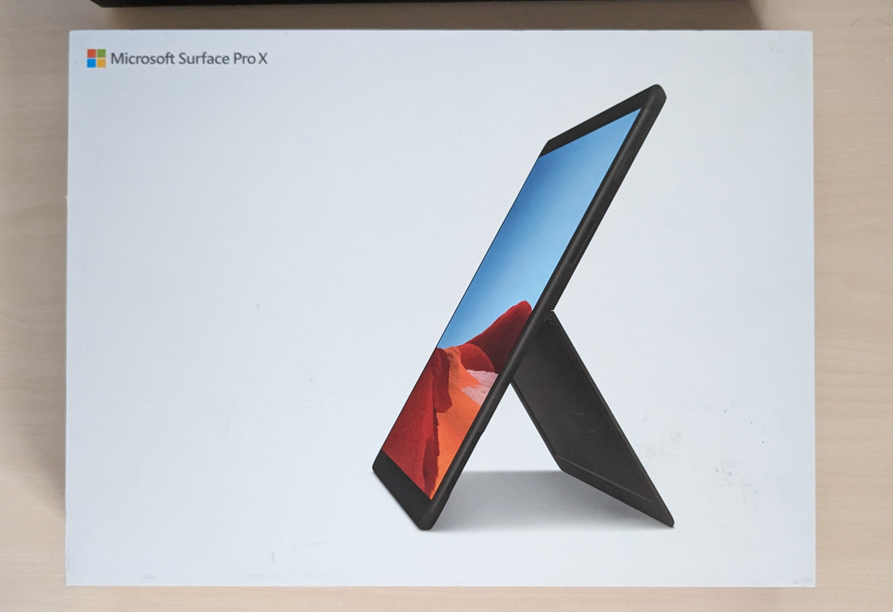
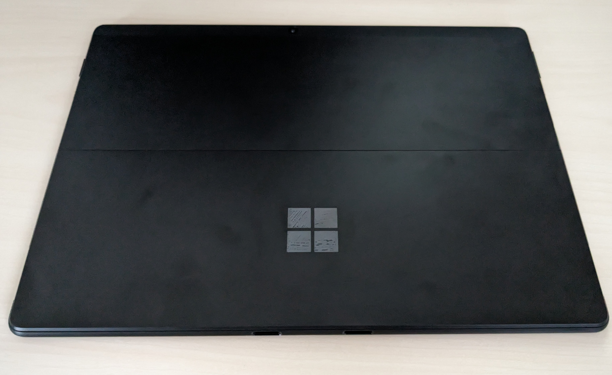
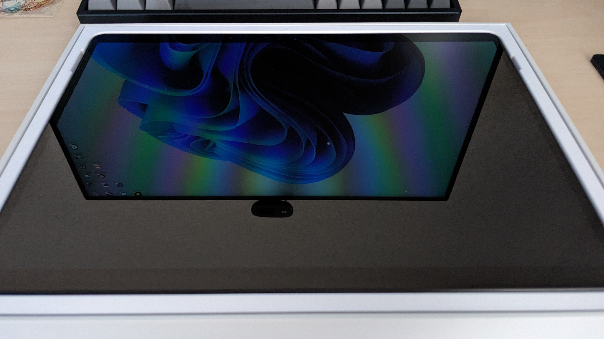
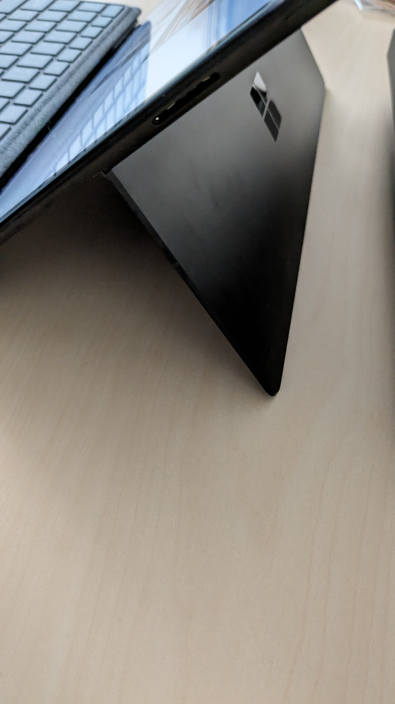
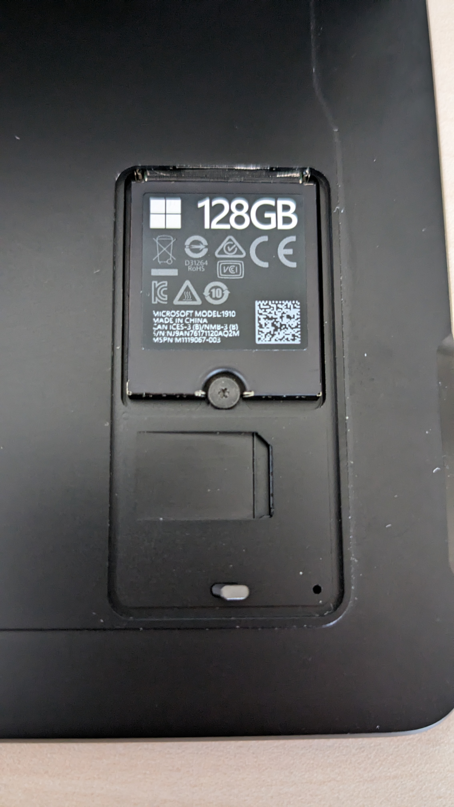
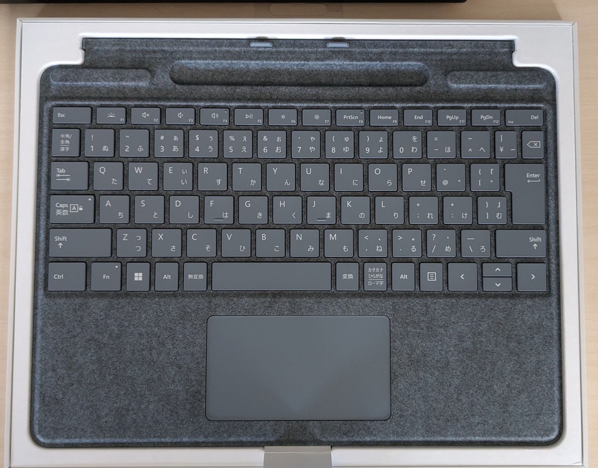
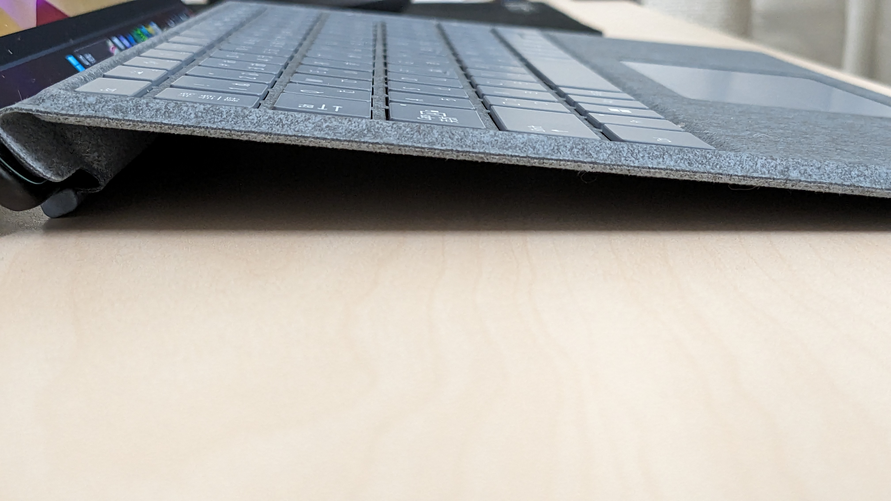
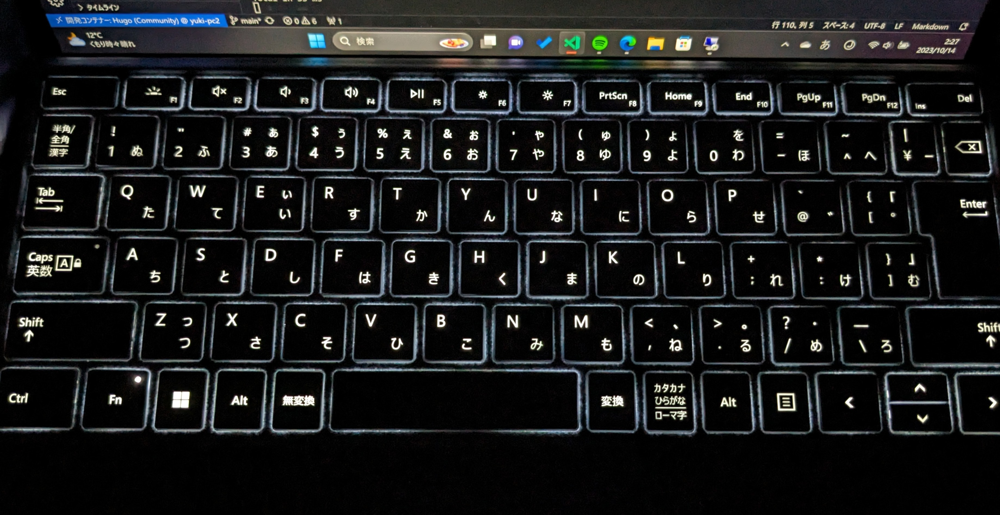

## SurfaceProXって何？

Microsoftが2019年に発売した2in1PCです。
特筆すべき点はプロセッサに**ARM**を採用している点でしょう
これにより電力消費量を抑えつつ高性能な処理性能を得ることが出来るはずでした。

しかし大半のWindowsのアプリケーションはx64やx86でコンパイルされていいます。
当然そのままでは動かないためエミュレータで動作させることになるのですが
そうなるとオーバーヘッドが大きく快適性が大きく損なわれることになりました。

そんなこともあり評価はイマイチだったようです。

## 購入理由

- 中古で安かった
- 欠点を理解した上で自分の用途に最適と判断した
- 高級なデザイン
- LTEに対応している
- ロマン

大体最後が理由です。

フリマで販売されていた中古品を買いました。
バッテリの状態が比較的良好で目立った傷がない~~良品~~ではなく
カメラが死んでいる個体でした。

本体価格は**53,000円**
未使用未開封の専用機ボードを合わせると合計**65,000円**でした。

## スペック

|項目|SurfaceProX|
|---|-------------|
|OS|Windows10|
|CPU|Microsoft SQ1/SQ2|
|RAM|LPDDR4x 8GB/16GB|
|SSD|M.2 2230 128GB/256GB/512GB|
|Wifi|Wifi 5|
|Bluetooth|5.0|
|画面比率|3:2|
|ディスプレイタイプ|LCD 60Hz|
|ディスプレイ解像度|2880 x 1920(267ppi)|
|輝度|450 nit|
|タッチ|10点 マルチタッチ|
|画面サイズ|13.3インチ|
|スピーカ|Dolby® Audio™　ステレオ2W|
|フロントカメラ|1000万画素AFカメラ|
|リアカメラ|500万画素|
|生体認証|WindowsHello 顔認証, 指紋認証(オプション)|
|GPS|対応|
|USB|TypeC x2|
|SIM|micro x1,eSIM x1|
|PD|対応|
|バッテリ持続時間|15時間|
|重量|774g|
|筐体|カーボン コンポジット ファンレス熱冷却機能を備えた、シグネチャ陽極酸化アルミニウム|

```markdown
LTE バンド：1, 2, 3, 4, 5, 7, 8, 12, 13, 14, 19, 20, 25, 26, 28, 29, 30, 38, 39, 40, 41, 46, 66
```

[詳細](https://www.microsoft.com/ja-jp/surface/devices/surface-pro-x/tech-specs)

## 開封

自分が購入したのはSQ1 8GB 128GBモデルです。

















## ソフト面

x86 x64がエミュレートされている以外はほぼ普通のWindowsです。
2in1なのでタブレットとしても使用できますがAndroidやiPadOSほどタッチ操作に最適化されておらず専用キーボードがないと不便な場面が多いです。

## カメラが使えない問題

前述のとおり私が購入した個体はカメラが使用不可でした。
これでは顔認証が使えないため困ります。

ところでこんな[記事](https://gigazine.net/news/20230525-surface-pro-x-cameras-stopped-working/)を見つけました。

なんか簡単に修正できそうですね
データ初期化ついでに最新のWindows11 2H22とドライバをインストールすることで解決

## 性能評価

ベンチマークは細かく検証しているサイトが複数存在するのでやりません

### 処理性能

ざっくりですがSQ1はモバイル向け第８世代Core i5とほぼ同等の性能です。
軽いワークロードでは十分な性能ではありますがちょっと物足りなさを感じます。

メモリは8GBですがEdge,vscode,音楽プレーヤーを同時起動しながらの作業では
メモリ不足を感じることはありませんでした。

### 画面

2880 x 1920の高解像度液晶です。
画素密度はiPadとほぼ同等でありドット感を感じさせません
また発色もよくコンテンツ消費にもおすすめできます。

一方でノングレアではない光沢タイプなので
文章作成などでは反射で気が散る可能性があります。

### スピーカー

２Wのステレオスピーカーなので大したことないかなと思っていたのですが
いい意味で期待を裏切られました
iPadに匹敵するクラスです。

### LTE

本機種は4GLTEモデムを搭載
SIMは物理x1とeSIMx1のデュアルSIMに対応

デザリングが当たり前の時代
必ずしも必要な機能ではないですが
あると嬉しいですね。

## 整備性

この機種はSSDは最近流行りの基板に直接取り付けるタイプではないため
簡単に交換ができます。

一方でバッテリ交換は個人で可能ではあるものの非常に多くの分解手順を踏む必要があり
難易度は高めです。

## まとめ

やや癖のある端末ではありますが
筆者は音楽を聴きながらVsCodeを使ったり
ブラウザからWebアプリ触るくらいのことしかしないので特に大きな不満もなく
快適に使用できております。

また処理性能を除けば最新のタブレットと比べても劣らない画面やスピーカを備えており
用途次第では数年は余裕で使えると思います。

中古ではありますが6.5万円でこのようなWindowsマシンが手に入るのはかなりお買い得でした。

### 良い点

- SSDの交換が簡単
- ファンレス
- ディスプレイの品質が高い
- スピーカも平均以上
- 軽量で持ち運びやすい
- LTE対応

### 悪い点

- SoC(CPU)の性能が低め
- 動かないソフトがある
- x86,x64アプリのパフォーマンスはよくない
- バッテリ交換が難しい
