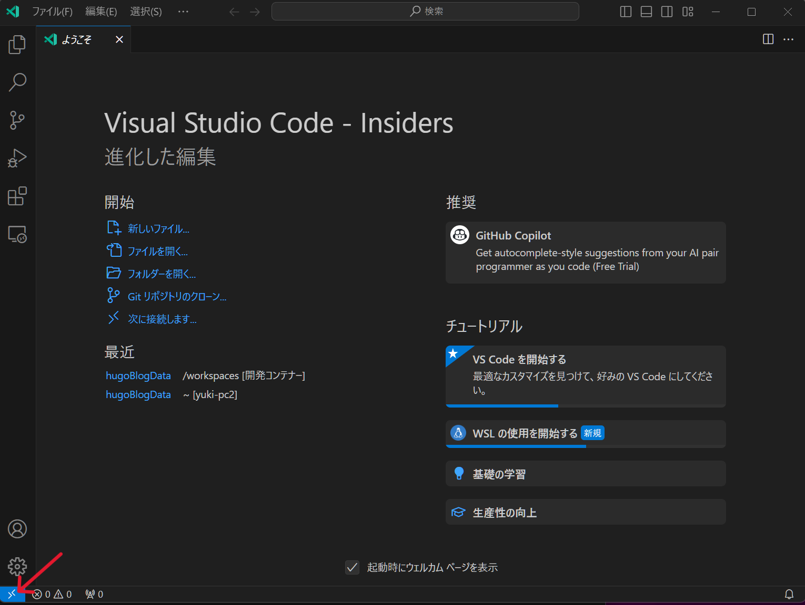

## はじめに

リモート環境でコンテナ開発が簡単に出来るといいですよね？
そんな夢を叶えたい人向けの記事です。

### リモートトンネル

VSCodeに実装されている機能です。  
セキュリティ保護されたトンネルを利用して遠隔コンピューターのVSCodeにアクセスします。  
これによりクライアントマシンはVSCodeとインターネット回線さえあればどこでも開発が可能になります。

[公式ドキュメント](https://code.visualstudio.com/docs/remote/tunnels)

### DevContainer

VSCodoの拡張機能です。  
構成ファイルを用意すればボタン一つでコンテナ開発環境が出来てしまう夢のようなシステムです。

[公式ドキュメント](https://code.visualstudio.com/docs/devcontainers/containers)

この二つの機能を同時に使用できる環境を作ります。

### どうやって作るの？

LinuxにVSCode入れて設定するだけです。

## 準備

### 前提条件

- VSCodeがインストール可能な端末
- Linuxが実行可能なPC(VMやWSL2でも可)
- githubアカウント

### 制約

リモートトンネルでDevContainerが使えると言いましたが、現状はサーバー側がLinuxでないと機能しません  

また[vscode.dev](https://vscode.dev/)での利用は**非対応**となります。  
つまりiPadやAndroidでは残念ながら使用できません。

VSCodeがインストールできる環境を用意しましょう

## 環境構築

今回は以下の状態で進めていきます。
また、Ubuntu 22.04の初期設定は既に終わっているものとします。  
クライアントのVSCodeにはあらかじめ以下の拡張機能を追加しておいてください

- remote - tunnels
- Dev Container

### 実行環境

#### クライアントPC

- Windows11 Home 22H2
- VSCode insiders

#### サーバ

- Windows11 Pro 22H2
- WSL2 Ubuntu 22.04 ストア版

### Dockerをサーバーに導入する

まずは、Dockerをサーバー(WSL上のUbuntu)に導入します。

#### Dockerリポジトリを登録する

こちらの[手順](https://docs.docker.com/engine/install/ubuntu/)を使います。

必要なパッケージを導入

```bash
sudo apt-get update && sudo apt-get install \
ca-certificates \
curl \
gnupg
```

GPGキーを登録

```bash
sudo install -m 0755 -d /etc/apt/keyrings
curl -fsSL https://download.docker.com/linux/ubuntu/gpg | sudo gpg --dearmor -o /etc/apt/keyrings/docker.gpg 
sudo chmod a+r /etc/apt/keyrings/docker.gpg 
```

#### Dockerをインストール

```bash
sudo apt-get install \
docker-ce \
docker-ce-cli \
containerd.io \
docker-buildx-plugin \
docker-compose-plugin
```

#### Dockerの動作確認

```bash
sudo docker run hello-world
```

確認メッセージが出たらDockerの導入は成功です。

#### 非ルートで実行できるようにする

ユーザーをdockerグループに登録する

```bash
sudo usermod -aG <ユーザー名> docker
```

### VSCodeをサーバーに導入

VSCodeをサーバー(WSL上のUbuntu)に導入します。  
今回はインサイダー版を使います。

#### VSCodeをダウンロード

公式ページからパッケージをダウンロードします。

```bash
curl -OL https://code.visualstudio.com/sha/download?build=insider&os=linux-deb-x64
```

#### VSCodeをインストール

ダウンロードしたファイルを`apt`でインストール

```bash
sudo apt install ./<ダウンロードファイル>.deb
```

#### リモートトンネルの起動

WSLで実行する場合windows版の導入を勧められる場合がありますが`y`で無視してください

```bash
code code-insiders tunnel
```

初回起動時は、指定したURLにアクセスするよう促されます。  
アクセスするとGitHubが開きます。コード入力画面が表示されるのでCLIに表示されているコードを入力してください  
成功するとリモートトンネルが開始されます。

#### リモートトンネルの動作確認

クライアントマシンでVSCodeを起動します。  

VSCodeのアカウントにGitHubでログインします。  
左下の人間マークを押すとログインの選択肢が表示されます。  

次にリモートトンネルに接続します。




接続できればあとは普段通り利用できます。

これでDevContainerが使用できるリモートトンネルが完成しました。

### 起動の自動化(オプション)

やらなくても問題ありませんがより便利に使いたい人向けです。  
windowsが起動したときにリモートトンネルが自動で実行されるように変更します。

#### サービスの登録

```bash
code code-insiders tunnel service install
```

これでWSLが起動した際に自動でリモートトンネルが開始されます。

#### windowsの起動時に自動で実行されるようにする

##### WSLのアップデート

WSLをプレリリース版に変更します。

```ps
wsl --update  --pre-release
```

これを行わないと後述する方法でうまく動作しません

##### タスクスケジューラーに登録する


再起動してログオンせずにほかの端末からリモートトンネルに接続できれば設定は終了です。

## 終わり

以上で作業は終わりです。
お疲れさまでした。
